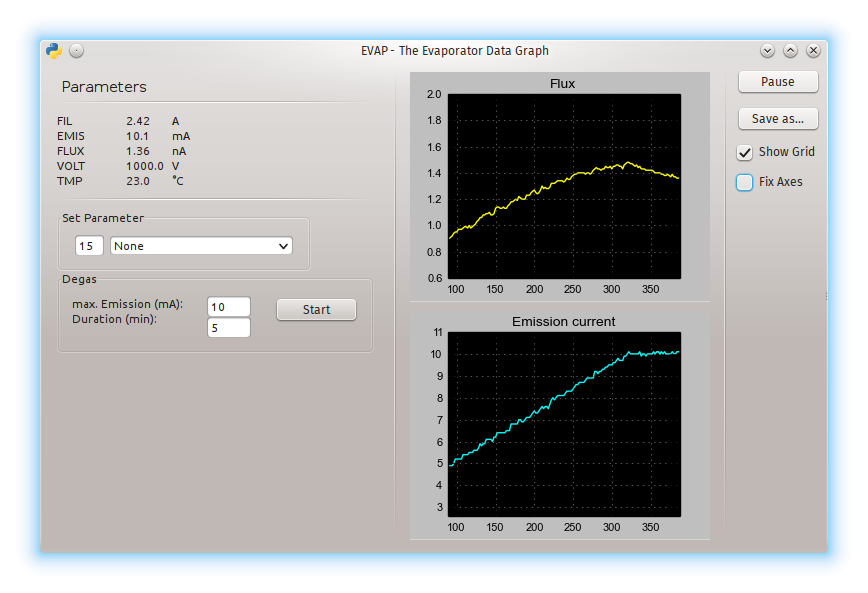

## EVAP - The EVC Data Graph
EVAP is a simple Python 2 program to read and plot the data from the e-beam
evaporator controller EVC 300 (FOCUS GmbH) as well as to set the parameters
time dependent.

## Dependencies
Tested on Ubuntu Linux 14.04 using a USB-to-RS-232-adapter and the EVC 300
controller. To connect to the serial port the python module 
[Pyserial](https://github.com/pyserial/pyserial) is used.
For the GUI pywx, numpy, matplotlib and pylab are required.

## Usage
In order to work properly EVAP needs read and write access to the serial 
device (usually `\dev\tty0` or in case you use a USB adapter `\dev\ttyUSB0`).
Start EVAP on the terminal by executing guievap.py.
If the controller is not found by EVAP an error message will appear on
the command line. As soon as the controller is connected and the Resume button is pressed
the values of the parameters will appear in the corresponding field.

The voltage and emission parameters can be changed directly within
certain boundaries in order to protect the equipment. Moreover
the emission current can be driven over time to make degassing more 
convenient (the main purpose of this program).

The plotted data for flux and emission can be saved in a CSV-file.

## License
LGPL

## Authors
EVAP was written by Paul Brehmer, Keno Harbort and Jan Höcker.

